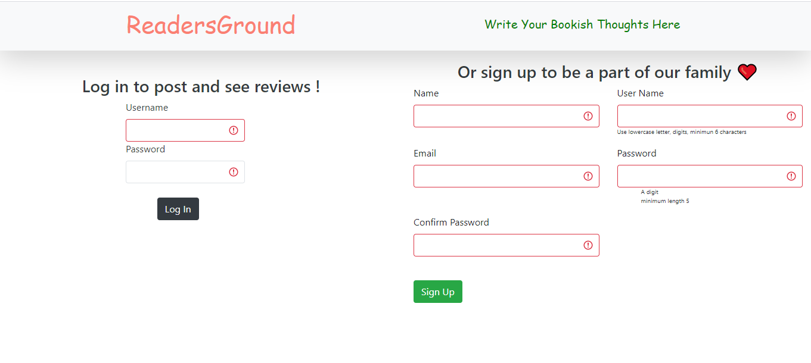
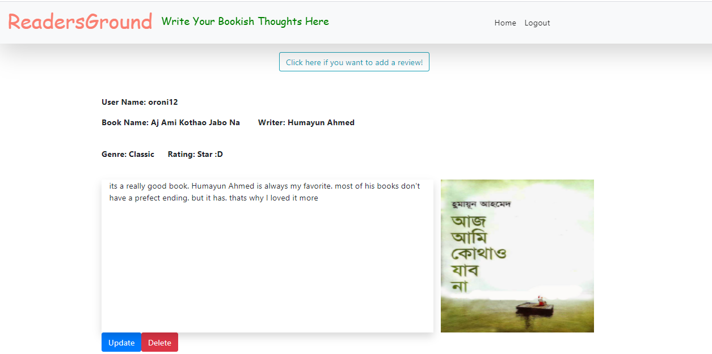
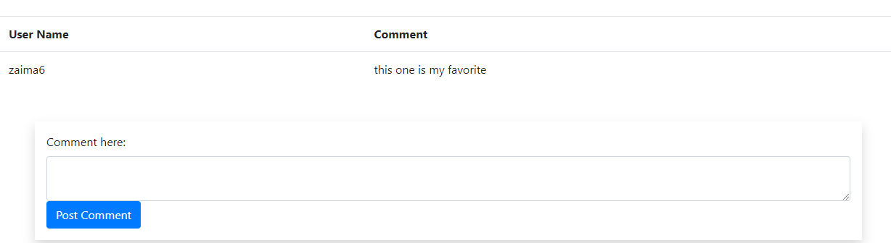
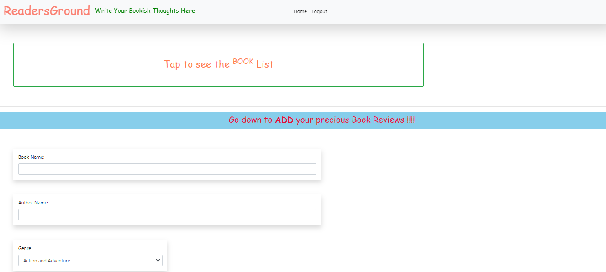
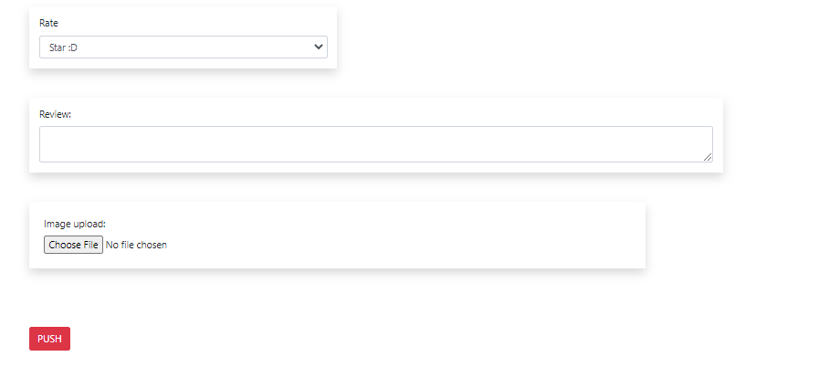
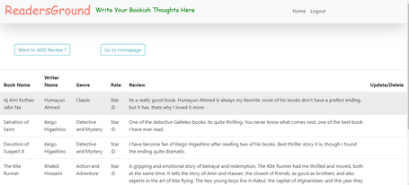
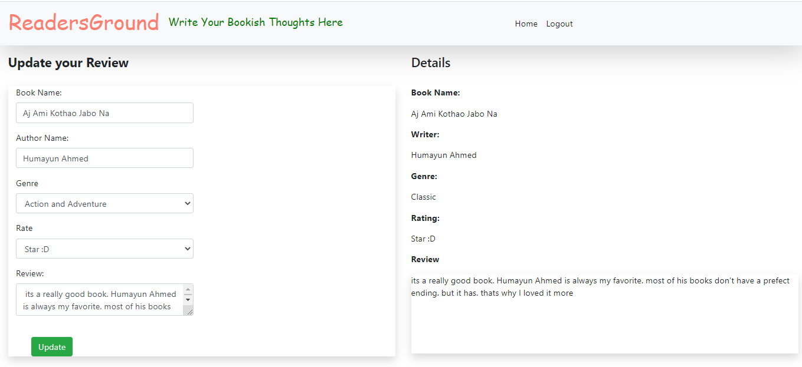

##How to use ?
###Signup/Login
- Users must have a registered account to see the reviews, ratings, and comments.
- For registration, the username length should be 5. It must have lowercase letters and digits. All fields are required.

###Home
- **After successful registration or logged in, we can see the home page.**

###Comment

- **We can comment there.**

###Push Review
- **Next we can add our own reviews and ratings and push it.**

###Book List

###Update
-**Incase we need to update our reviews after push, we can update it too.**

###Delete

